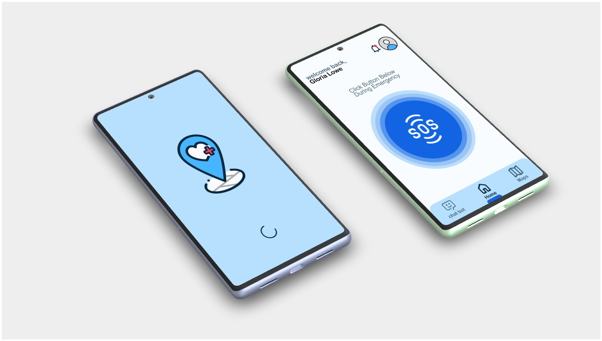
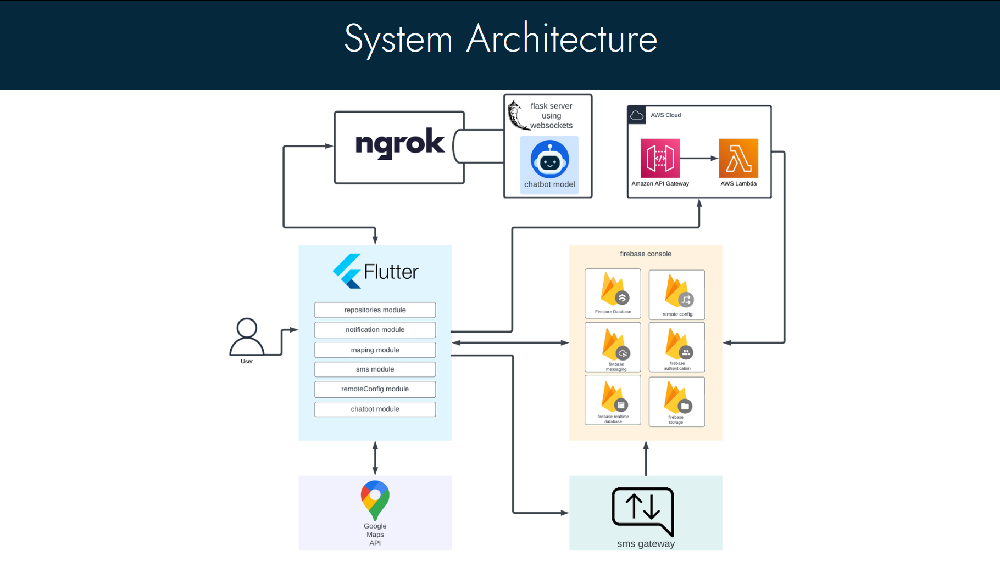
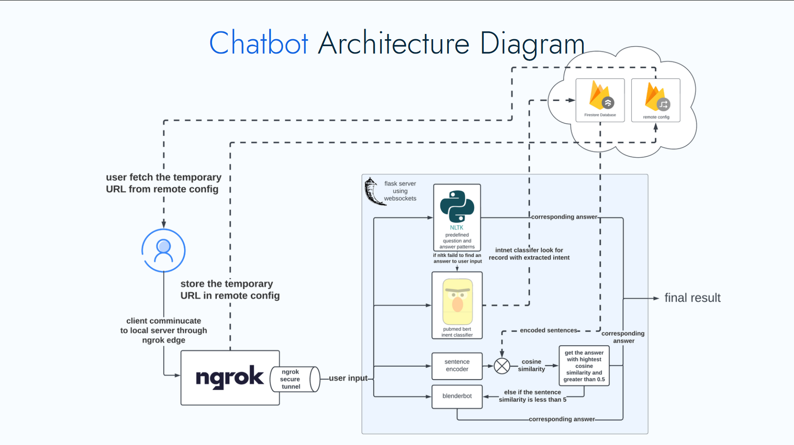

# CodeBlue - Emergency Assistance App

CodeBlue is a Flutter-based mobile application designed to provide quick and efficient emergency assistance. This README file outlines the key features and system objectives of the CodeBlue app.

### watch this explanatory video

## Features

1. **User Sign-Up**: Users can sign up using their name, email, and phone number to create an account.

2. **Caregiver Support**: Users can add a list of caregivers who will be informed in case of emergencies. Caregivers receive notifications via the app and can also receive SMS messages (if activated). In the absence of internet, SMS messages are sent to both caregivers and a server phone number to ensure that help can be summoned even without an internet connection.

3. **Emergency Request**: The home page features a prominent button that automates the process of requesting an ambulance and notifying caregivers using specified methods.

4. **Ambulance Tracking**: After requesting an ambulance, users can track its real-time location as it approaches.

5. **First Aid Chatbot**: A chatbot provides users with first aid information in both English and Arabic languages. The chatbot uses separate machine learning models for each language to provide accurate information.

6. **Multi-Language Support**: The app supports both English and Arabic languages.

7. **Emergency Contact List**: Users can maintain a list of phone numbers to send SMS messages in case of emergencies, even if the recipients don't have the app.

8. **Alternate Location Request**: Users can request an ambulance to a location other than their current one.

9. **Medical Card**: Users can fill in their medical card with information such as height, weight, age, blood type, medical allergies, medical conditions, medications, and remarks.

## Architecture Diagrams

## System Objectives and Constraints

### Front-End Design

The front end is designed with a simple and clear interface to ensure quick access to emergency features. It employs design elements that emphasize the urgency of emergency situations, utilizing color schemes, icons, and animations. The app provides language options for displaying instructions and information in both English and Arabic. Offline functionality is integrated to allow users to access essential features when internet connectivity is limited. Clear status and progress indicators keep users informed during emergencies.

### Back-End Design

The back end of the application is responsible for server-side development, data management, and processing. It includes server implementation, databases, APIs, and business logic. It ensures the efficient processing and storage of data, integration with external services, security, scalability, and performance optimization. The back end supports user account creation, uploading medical records, requesting ambulances, tracking ambulances, and providing first aid information through the chatbot.

### First Aid Chatbot

The chatbot is designed to offer first aid and medical information in both English and Arabic. It uses separate machine learning models for each language to provide accurate and reliable information. The chatbot interacts with users in a compassionate and empathetic manner, fostering a friendly atmosphere for users seeking medical guidance.

### Maps and Navigation

Maps play a critical role in the application for accurate location reporting, resource allocation, routing, and navigation. Maps enable emergency responders to reach the scene quickly and provide immediate assistance. They enhance situational awareness, assist in identifying hazards, and offer visual confirmation of reported locations. Maps are integral to the efficient functioning of the emergency response system.
